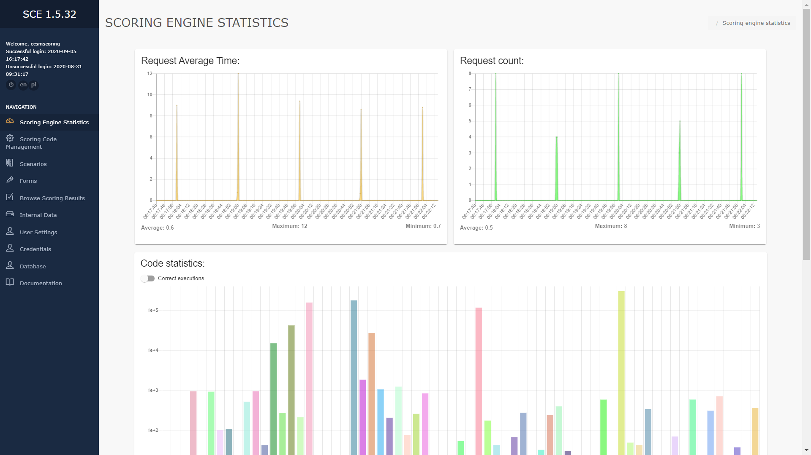
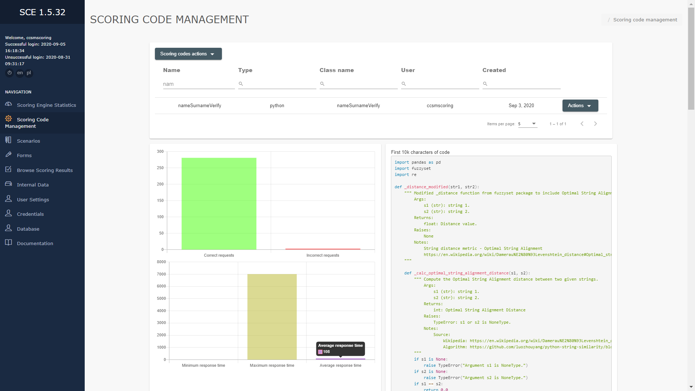
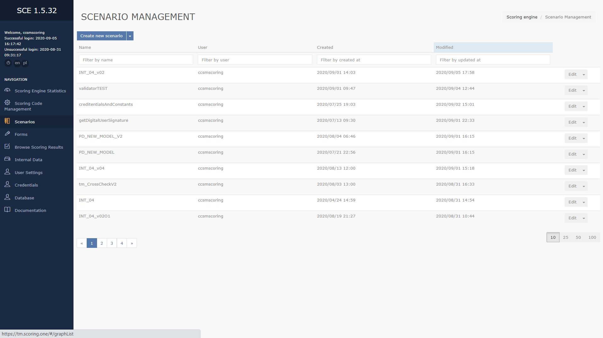
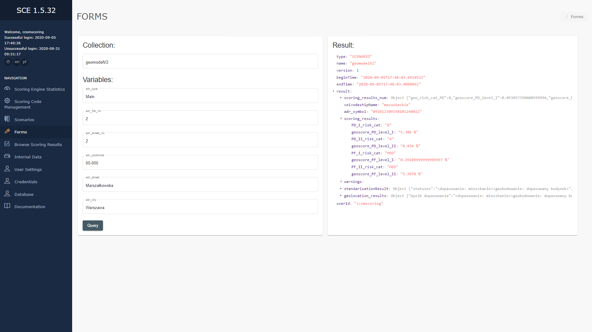
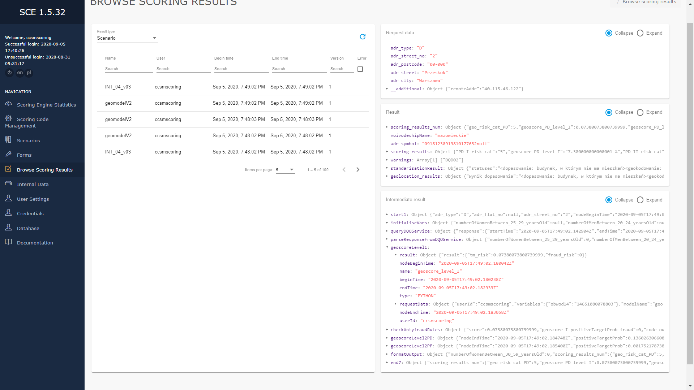
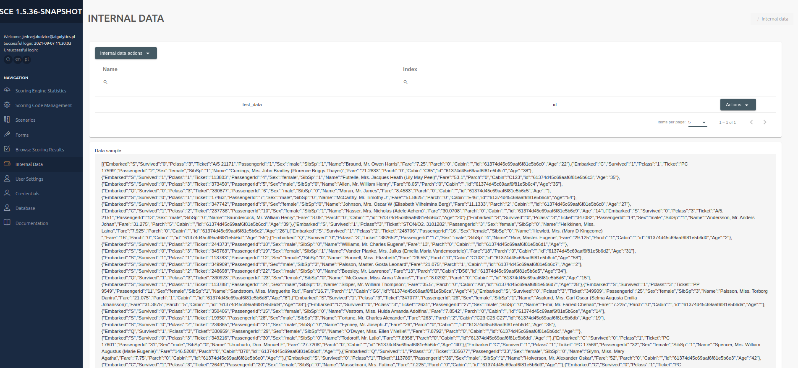
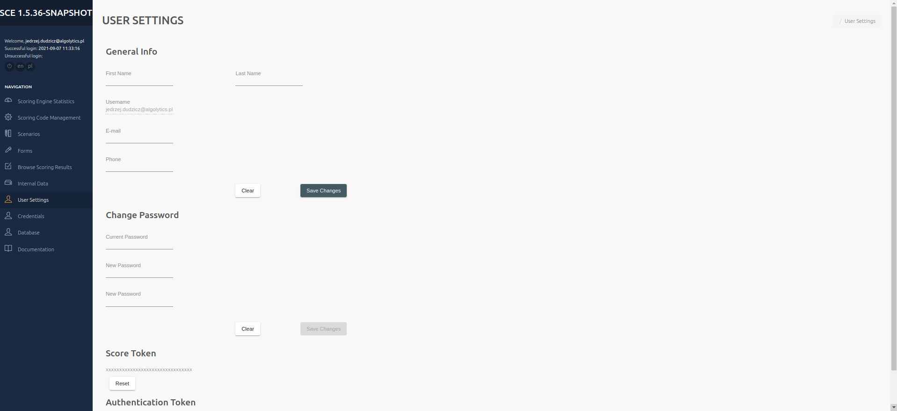
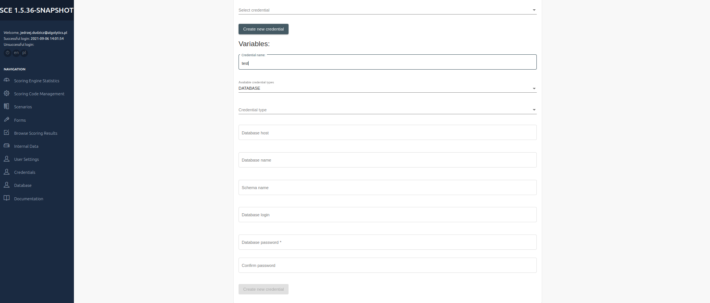
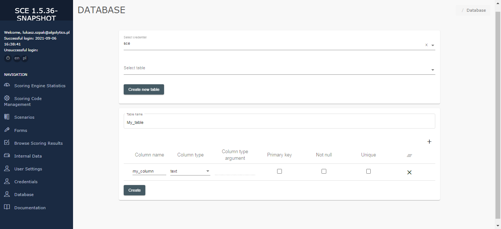

# Panels overview #
Menu on the left side of the screen contains buttons for logging out of the scoring engine and for changing the language, and buttons directing the user to panels.

### Scoring Engine Statistics ###
Scoring Engine Statistics
This panel contains scoring engine statistics. 
On the top part of the panel shows the following two column charts: requests count and request average time.
In addition, this panel contains code statistics showing the number of requests by scoring code / scenario.

### Scoring Code management ###
Scoring Code management panel is designed to add, view and export scoring codes. It consists of 2 parts: the button "Scoring codes actions" for adding new scoring codes and a table with information about the added codes. Selecting Upload new model will open an area for adding new code. In the upper part of the area there is the Scoring code name field, where you should enter the code name and the Type field to select the language of the uploaded program. To select a code file, drag the file to the special field with a blue border in the middle of the area, or click this field and select the file. The added files are displayed at the bottom of the area in the table.
By selecting the Import from JSON option, we load the models in the JSON file as described above. The last option is Export. After clicking, the JSON file with all models will be downloaded.

The table with information about the codes contains following columns:

- **Name** – code name
- **Type** – code type
- **Class name** – name of the class
- **User** – name of the user, who added the code
- **Created** - date of adding the code

On the right side for each code there is a drop down list with 4 buttons: Export, Download and Delete, and Version. The Version button is used to set the code version, the Delete button removes the code, the Export and Download buttons respectively downloads the code in the .json format or the selected code format.
After clicking on the code, 2 sections will appear: Statistics and Scoring Code Source.
The Statistics section shows the code statistics: number of valid and invalid requests and maximum, minimum and average response time.
Scoring Code Source shows the scoring code.

### Scenarios ###
Scoring Code management panel is designed to add and view scenarios. To add a new scenario, click Create new scenario button, located on top of the panel. Next to the button, there is a drop-down list containing 2 buttons: export and import, that can be used to export or import a scenario. The export button download a JSON file with scenarios data. The import button opens a window, where user must drop a JSON file or click to upload one, and a button to overwrite existing scenarios. Under the Create new scenario button there is a table with information about the scenarios, containing following columns:

- **Name** – scenario name
- **User** – name of the user, who created the scenario
- **Created** – date of scenario creation
- **Modified** – date of last scenario modification

To the right, for every code there is  a drop-down list containing Edit, View, Tests, Version, Export, Delete and Copy buttons. 
Edit button moves the user to editing screen, View moves the user to view screen, Tests button is used to test the scenario, Version button is used to set the scenario version, Export button export scenario to JSON file, Delete button deletes the scenario and Copy button copy the scenario. 
After clicking a scenario, 2 buttons will appear: Metrics and Scenario Code Src. Metrics button shows scenario statistics: number of correct and incorrect requests, maximum number of requests per second and maximum, minimum and average response time. Scenario Code Src presents a scenario code.

### Forms ###
Forms panel is designed to query scoring codes and scenarios. The panel contains a drop-down list of scoring models, scenarios. After choosing a model/scenario, fields corresponding to model/scenario input variables will appear below. To query a model/scenario, enter values of variables info the proper fields, and click Query button. Results of the query appear below the Query button.

### Browse scoring results ###
This panel is designed to browse results of queries. Results are presented in 5 categories, depending on result type (Scoring model, Scenario, Pmml model, R model, Python model). Category can be chosen through a drop-down list, located on top of the panel. For each category the panel contains a table with information about queries, containing following columns:

- **Name** – model/scenario name
- **Type** – model/scenario type
- **User** – name of the user, who created the query
- **Request** – input data of the query
- **Begin time** – start time of query execution
- **End time** – end time of query execution
- **Result** – result of the query
- **Version** – model/scenario version
- **Error** – information about an error (if occurred)

### Internal Data ###
This panel is designed to adding CSV data. To add a new data, click Internal data actions button, located on top of the panel. Bottom to the button, there is a drop-down list containing 2 buttons: Load a CSV file and Create collection. 
To add a new data, click Internal data actions button, located on top of the panel. Bottom to the button, there is a drop-down list containing 2 buttons: Load a CSV file and Create collection. 
After selecting Load a CSV file, the Scoring Collection name field will appear in the upper part of the area, in which you should select the Colletion name to which you want to load the file. To select a CSV file, drag the file to the special field with a blue frame in the middle of the area or click this field and select the file.
By selecting the Create Collection option in the upper part of the area, the Scoring Collection name field will appear, in which you should enter the Colletion name you want to create for storing CSV files. To select a CSV file, drag the file to the special box with a blue border in the center of the area, or click this box and select the file.

### User Settings ###
This panel is designed to manage user data.
The General Info section is at the top.
The user name is displayed. It is possible to change the name, surname and telephone number by entering it in the gap and confirming with the Save Changes button. To reset unsaved information, press the Clear button.
In the middle there is a part of the Change Passoword,
To change the password, enter the current password and enter a new password and confirm it. Finally, confirm the changes with the Save Changes button. To reset unsaved information, press the Clear button.
Under the Change Password section, I find the Score Token needed for the API.
It can be reset with the Reset button.
At the very bottom there is an Authentication Token.

### Credentials ###

Credentials panel allows you to create new tables from Scoring.one level​.
To create a new CREDENTIAL, click the Create new Credential button at the top of the panel. 
Two fields will appear under the button:

- **Credential name**
- **Avaliable credential types** – DATABASE is currently available for selection

Then a list with the fields will appear:

- **Credential type** – POSTGRES and MYSQL are currently available for selection
- **Database host**
- **Database name**
- **Schema name**
- **Database login**
- **Database password**
- **Confirm password**

### Database ###

Database panel allow you to manage table in the Credential.
Selecting Credential will show Select Table option.
To manage the database, click Choose Credentials at the top of the panel. Selecting the credential will display the Select table option, where we can select tables or create a new table with the Create new table button.
After selecting the Create new table option, enter the name of the new table in the Table name field. 
We create columns to complete the given information and confirm with the Create button.

Column fields:

- **Column name**
- **Column type**
- **Column type argument**
- **Primary key**
- **Not null**
- **Unique**

### Documentation ###
Clicking Documentation button in the menu on the left side of the screen open the documentation in new window.