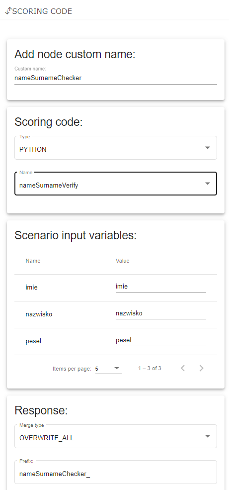

# Creating and testing a scenario #

### General description ###
A scenario is an advanced form of code, allowing the user to combine scoring and pmml models, other scenarios and internal and external databases. 
To start building a scenario, click Create new scenario in Scenarios panel. 
To create a scenario, connect selected nodes, starting with a Start node, and ending with an End node, and define settings of added nodes. 
To generate a created scenario, click the Deploy button, located in the upper left corner of the screen. 
Changing the name of a scenario is possible in the upper left corner of the screen. 
User can also change a name of a node by clicking it twice and entering a new name.


### Nodes ###

- **Start** – a starting node. Consists of 4 sections: Add node custom name, Create type, Input variables, Variable validator and Import.

	In the Add node custom name section user can name start node.

	In the Create type section you can define your own type.

	The Input variables section presents added input variables. The table contains information about variable name, description and type, information whether the variable is required and a button to delete the variable.

	In the Variable validators section user can manage variable validators (fragments of code verifying, whether an entered value of the variable is correct). This section presents a list of variables. For each variable the table contains the number of validators and 2 buttons: add and clear. The edit button opens a window, in which validators can be added or edited, the clear button deletes all validators. Example of a validator is presented below:

	```
	if ((object as String).length()!=32) wynik=false; else wynik=true; return wynik
	```

	In the Import section, user can import a list of input variables from a CSV file. Example of CSV file with input variables is presented below:
	
	``` 
	true;var3;DOUBLE;;
	true;var4;aa#bb#cc;;
	```

	Columns of this CSV contain, respectively, an information whether the variable is required, variable name, type, description and tags.
	
	Available types: STRING, DOUBLE, INTEGER, DICTIONARY, MAP, VECTOR, BOOLEAN

	

- **Scoring code/Scenario code** – node used to add a scoring code/scenario code to the scenario. 
	After adding the node, enter the scoring code/scenario code name. 
	In Scoring code node, the type of the code must be set in Type list. 
	Import of necessary variables to the Start node is possible through the Import variables button. 
	In the node user also defines merge type of variables added by this node and a prefix of these variables.
	

	
	

- **Expression** – node allows you to add application processing elements in the form of a script (Groovy/R/Python ). 
	Node consists of an area  2 buttons: Edit and Remove. 
	The Edit button opens a window to edit the code, the Remove button deletes the code. 
	There is also a list, where user can choose code type. 
	In the node user also defines merge type of variables added by this node and a prefix of these variables. 

	

- **Decision** – node used to divide the scenario depending on a decision. Node consists of an area with a Java code and 2 buttons: Edit and Reset. 
	The Edit button opens a window to edit the code, the Reset button deletes the code. I
	n the node user also defines merge type of variables added by this node and a prefix of these variables. 
	To divide a scenario, enter a condition in the Java code area and connect 2 nodes to the Decision node - one node must be connected to the node's green dot (it will execute when the condition is fulfilled), and the other node must be connected to the node's red dot (it will execute when the condition is not fulfilled). Connections are marked by a green and red line respectively. 
	
	A correct use of the node is presented below:

	


	**Attention**: The Reset button deletes the whole code. After saving the node it is not possible to undo this operation.


- **Internal data** – node used to add an internal database. 
	To add a database, define join conditions: Join variable, Data collection (name of the database) and Data index. After selecting a database, in the Columns section a list of database columns will be presented. 
	For each column user can decide, whether it will be included in the scenario. 
	In the node user also defines merge type of variables added by this node, a prefix of these variables and whether results will be limited to one row.

	

- **External data** – node used to add an external database. 
	To add a database, define method (GET, POST, PUT, DELETE) and URL address, and add appropriate headers by entering their names and values and clicking Add. 
	Added headers are presented in the list below. In the node user also defines response type (JSON or XML), request timeout and retry values, using cache and catching an error, merge type of variables added by this node and a prefix of these variables.

	


- **customer data** – node contains a predefined query of WebService of economic and credit information providers.
	To add a database, define source type (CRIF, ERIF, KRD, BIG_INFO_MONITOR, BIK, getScore, DZ), data source login and password and whether it is a test mode, request timeout and retry values, using cache and catching an error, merge type of variables added by this node and a prefix of these variables.
	Depending on the provider in the node, you must configure the provider-specific access and authorization methods.
	
	

- **Database** - node is used to write a data record to the database linked in the initial credentials.
	Select Credentials option to connection to the base​ and choose table. 
	In Input Row pass values to fields in the database.
	In addition, there is a method available from the Groovy script to write multiple records to multiple tables in one operation.​
	To allow using this feature user have to define database connection in advance (Credentials & database panels).

	


- **Cross Checking mode** – node is used to implement rules that validate the data of the current transaction and historical transactions​.
	The rule that has been verified positively generates an "alert".
	The node contains 3 sections:
	- **Collection** - the name of the auxiliary structure to write historical data​
	- **Validator** - validation rule​
		- **Search time** - search time window
		- **Keys** - search keys​
		- **Validators** - a set of conditions checking rules​
			- **Example** 
				``
				databaseVariable!=scenarioVariable​
				``

	

- **Cache** - node is used to write data to a handy shared structure between different scenario processing instances​.
	Application to synchronize parallel processing of the same object or to write data of an interrupted process that can be resumed.
	The node contains:
	- **Cache action** - SAVE, REMOVE, GET​
	- **Key** - data record key ​
	- **Value** - value – it can be any object structure​
	- **Cache time** – maximum storage time in the cache

	


- **End** – an ending node. 
	The node contains a list of all variables generated by previous nodes, that have not been overwritten. 
	For each variable user can decide, whether this variable will appear in scenario result.

	


### Scenario testing ###
After generating a scenario correctly, it is possible to query the scenario in the Forms panel. To query a scenario, select one from drop-down list Choose a scenario, enter values of input variables (defined in the Start node) and click Query. If the query is correct, variables defined in the End node and their values will appear below. Otherwise, an appropriate error will appear. User can view all queries in Browse scoring results panel.
